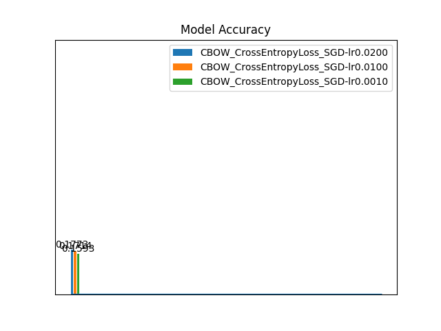
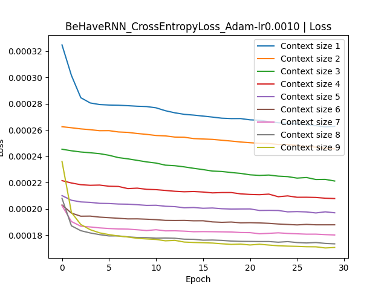
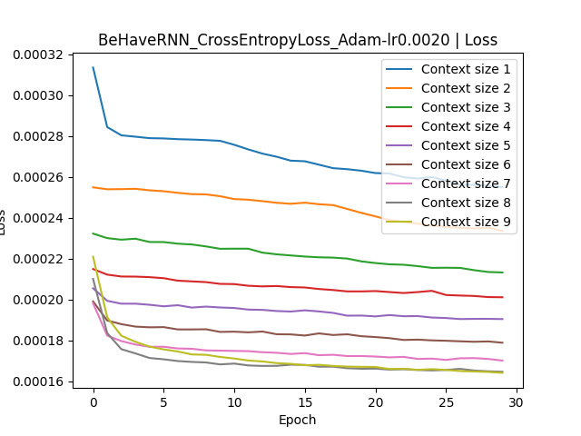
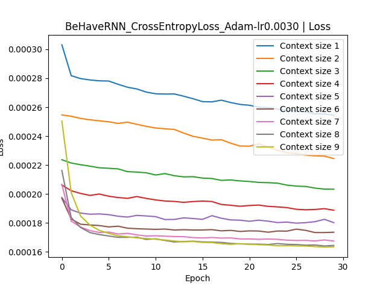
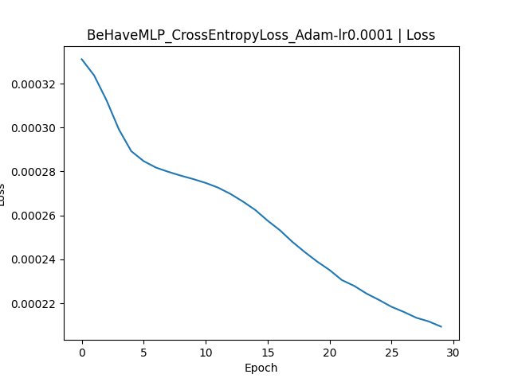
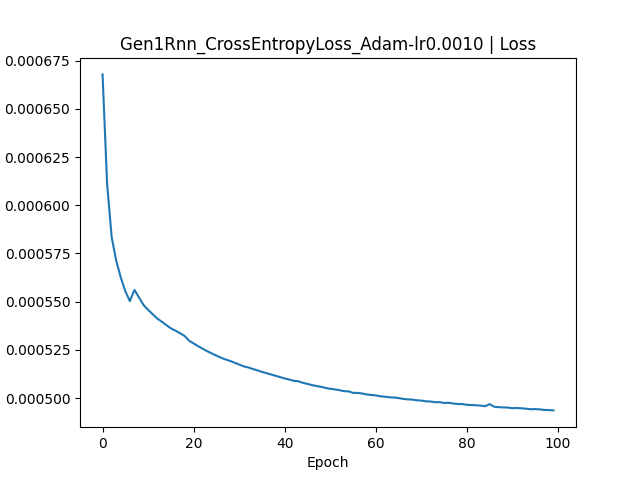

# UIB INF265 Project 3
Group: **Project 3 17**  
Students:
- **Mats Omland Dyrøy (mdy020)**
- **Linus Krystad Raaen (zec018)**

## Distribution of labor

We mostly met at `Høyteknologisenteret` and performed our work there.  
Mats did most of the programming, Linus provided statistical insights and competence in deep learning.  
A computer did most of the computations, and here are the specs:  
**OS:** `Windows 11 Pro N`  
**CPU:** `Intel Core i9-10850K`  
**GPU:** `NVIDIA GeForce GTX 980 Ti`  
**RAM:** `32 GB`  

# 1. The data
Before getting started, we investigated the dataset.  
The training data consists of `13` books free books from the [Gutenberg project](https://www.gutenberg.org). The validation and testing datasets consists of one book each from the same project.  
All the books are in english.  

## 1.1 Preprocessing
Processing of the raw data happens at the top of the notebook through the `create_tokens` and `create_vocabulary` methods.  

`create_tokens` reads all the books in a given dataset (Identified by `data/input/<dataset-name>/<book-name>.txt`) and concats the data to generete one large string that is then split into tokens (word in our case).  
This gives us all the words from all the books in a dataset in the correct order.  
Because of this approach, the contexts formed when crossing a book-boundary will not nececarrily make sense.  
We choose to accept this because the ratio of good sentences to word boundaries are very high.  
This function is used three times to create the `words_train` (Training words), `words_val` (Validation words) and `words_test` (Testing words). 

`create_vocabulary` takes a collection of words and creates a vocabulary of all the unique words that occur more than `100` times.  
In our code, we choose to base the vocabulary on the `words_train` (all words in the training set) as it would create the most complete vocabulary.  
To focus on words, we also remove all names and numbers from the vocabulary.  
This function is only used once to generate the global `vocabulary` and `VOCABULARY_SIZE` values which are used throughout the rest of the assignment.

## 1.2 Preprocessed
When preprocessing was complete, we had three sets of ordered tokens `words_train`, `words_val` and `words_test` used for training, validation and testing respectively.  
We also had `vocabulary` which was a lookup table for all the words our models will be able to understand along with a `<unk>`-token for unknown words.  

The dataset distrubition looked like this:  
  
The training dataset contains significantly more tokens than the validation and testing sets.  
Out of the `53 105` unique tokens in the training data, we only kept `1 880`.  
Because of this, we expect low performance as out models will only understand `~4%` of the words.


# 2. Word embeddings
When selecting the global hyperparameters for the `CBOW` models, we naively thought the computer could handle an embeddingsdimension of `32` since the assignment proposes `16` as small.  
This was a rookie-mistake and training took `3 hours`. (3 hours after we got `cuda` working that is).

## 2.1 Choosing global parameters
As discussed previously, something posessed us to choose `32` as the size of the embeddings dimension.  
Increasing the `batch_size` ment we (the computer) could spend less time scheduling GPU-calls and more time executing GPU-calls resulting in faster results. Therefore we found `8192` to be a good compromise between training speed and memory usage. We decided that `5` was number and thus was fit to be the `context_size`.

| `context_size` | `batch_size` | `epoch_count` | `embeddings_dim` |
| :------------: | :----------: | :-----------: | :--------------: |
| `5`            | `8192`       | `100`         | `32`             |

## 2.2 Training
We trained the CBOW model by feeding it fixed length contexts of `5` tokens and had it try to predict the next token. We had lots of trouble with the `Adam` optimizer, and therefore choose to go with `SGD` instead.  
We decided to use a simple architecture of one `embedding`-layer and one `fully-connected`-layer.  

## 2.3 The models
We three variants of out `CBOW`-network: 

### Loss


## 2.4 Selection
Please note that the scale differes on the loss functions. For a fair comparison, we tested the models on a dataset made from the validation tokens:  


It's a close race, but `CBOW_CrossEntropyLoss_SGD-lr0.0200` performs the best.  
That said, since we picked the best performer on the validation set, we need new data to estimate the models true performance:  


If scoring low was good, out model would be great! Luckily, in this case we are not interrested in the model, we only want the embedding.  
After extracting the embedding and storing it as the global `embedding`-variable, we can test it.

## 2.5 Embeddings
We test our embeddings by taking interresting samples of which words are similar.  
To compute similarity, we use `cosine similarity` (This similarity has less bias for common words that say euclidian distance).

Here are some words and their `10` most similar words. (`1` is the most similar)
| Word | 1 | 2 | 3 | 4 | 5 | 6 | 7 | 8 | 9 | 10 |
| :----: | :-: | :-: | :-: | :-: | :-: | :-: | :-: | :-: | :-: | :-: |
| `king` | powerful | particularly | slept | effort | repeated | priest | arrival | dress | would | suppose |
| `queen` | laid | interresting | difficult | vast | conceal | foot | figure | note | fact | honest |
| `man` | begin | morning | hung | crossing | paces | slightly | guests | frequently | terror | hastily |
| `woman` | bad | branch | sppear | shudder | usual | there | captain | wind | boy | gradually |
| `he` | hearts | begged | shudder | military | marriage | proper | yourself | skald | husband | beds |
| `she` | wanted | quick | provided | reality | larger | found | driving | daughter | relations | suppose |

I could go on, but you get the idea. The embedding has not learned much of anything.  
You can find more examples in the notebook, but those are also mostly nonsense.  
On the bright side, it has concluded that `king` is similar to `powerful`, `good` is similar to `proper`, `she` is similar to `daughter` and `he` is similar to `husband`. That is something.  
On the darker side, it is completely convinced that `woman` is `bad`.

Overall I would argue the embeddings are quite bad.

To play around with the embeddings, use `word_find_top_closest` or `word_find_closest`. The functions have very similar names but can answer two very different questions.  
`word_find_top_closest` finds the top `n` most similar words to the given word.  
`word_find_closest` finds the closest word to the given embedding.  
This can answer questions like `doctor - man + woman = ?`.

## 2.6 Tensorflow Projector
This visualization gave me very little.  
The position in the visualizer has no correspondance to the words similarities to each other.  
This is inpart due to the word embeddings containing 32 dimensions, but are being squished down to three. (_Two in the image_)  
To highlight this, I have marked the word `surpised` and the five most similar words to it.

This is a problam that is very difficult to overcome, _(maybe impossible?)_ , as we observe the same lack of positional meaning when looking at the proper embeddings like `word2vec`.  


# 3. Conjugating _be_ and _have_
Now that the `vocabulary` and `embeddings` are in place, we can work on the conjugation models.  
At first, our models were trained to predict exactly one of `<unk>`, `be`, `am`, `are`, `is`, `was`, `were`, `been`, `being`, `have`, `has`, `had` and `having`.  
We quickly learned that the models would then learn to always preduct `<unk>` as this made up `95%` of our training cases.  
We identified this issue by using the `BeHaveAlways`-model predicting a constant value `<unk>`.  
In heinsight, we should have trained the model like we did in `Project 2` by having different loss functions for testcases with and without an actual word.  

## 3.1 Global parameters
Since we removed all the training cases where the target was `<unk>`, the dataset was reduced by `95%` and training was **much** quicker.  
Therefore, we could set `context_size=20` and `epoch_count=30`. It might not seem like much, we gave the `rnn` models special training.  
We had "great success" with `batch_size=8192`, and decided to keep that value.  
The context for training and validation are the `10` words before and after the target.

| `context_size`* | `batch_size` | `epoch_count`* |
| :-------------: | :----------: | :------------: |
| `20`            | `8192`       | `30`           |

`*`: When training the `rnn`-networks, we trained with a context size `20`, then `18`, then `16` and all the way to `2` for each epoch.  
This was so that the model, _if it were to win_, could be tested with varying context size.

## 3.2 Training
We trained six `rnn`-network variants and three `mlp`-network variants.  

### RNN Layout


### MLP Layout


### RNN Losses
Please note that when reading these graphs, the loss of `Context size 2` starts where the loss of `Context size 1` ended.  
That is: `2` continures training from where `1` stopped.  







### MLP Losses
Unlike the `rnn`-models, the `mlp`-models could probably do with a bit more training.  
We can see that the loss-curves have not yet flattened out like the others have.


  
_It's incredible how much more smooth the curves are using the `Adam` optimizer!_

### MLP w. attention Losses
We failed to get the attention layer working.

## 3.3 Selection
Like in the `CBOW`-training, the loss curves are not comparable, and we should not compare using the training data anyways.  
Here are the model performances on the validation data:  


We can se that two models outperform the others by a long-shot: `BeHaveMLP_CrossEntropyLoss_Adam-lr0.0010` and `BeHaveMLP_CrossEntropyLoss_Adam-lr0.0010`.  

Since `BeHaveMLP_CrossEntropyLoss_Adam-lr0.0010` performed the best, it was selected and tested on test-data to get a better estimate of real world performance:  
  
As expected, it performed best on the data on which is was trained, slightly worse on the data it competed on and the worst on the completely unseen data.

## 3.4 Usage
In the notebook, you can try this model using a `21`-word sentence and the `try_behave`-function.  
An example can be found:
```py
# From the beginning of Dracula 
# This is a text snippet from the training data, and will have a bias for success
behave_try("and that as it was a national dish I should", "able to get it anywhere along the Carpathians I found")
# Output: and that as it was a national dish I should (be) able to get it anywhere along the Carpathians I found
```
**NOTE:** If an `mlp`-wins, _which happened_, the two input parameters must contain exactly `10` tokens each, otherwise an exception is thrown:
```py
behave_try("Who", "you")
# Output: RuntimeError: mat1 and mat2 shapes cannot be multiplied (1x64 and 640x32)
```


# 4. Text generation
This task also relies on the `embeddings` and `vocabulary`.  
We made a fairly simple model:


## 4.1 Global parameters
When making the `be/have` models, we could reduce the training data significantly by removing the targets we did not care about. That is not an option here.  
Therefore, to make things run as fast as possible, we want the batch_size to be as high as possible.   

| `context_size` | `batch_size` | `epoch_count` |
| :------------: | :----------: | :-----------: |
| `20`           | `8192`       | `100`         |


## 4.2 Training
This time, due to the insane training times, we decided to only train three models.  
_On a side note:_ When starting to train this model, we picked a very high dimension for the hidden state.  
But the hidden state keeps a copy of its history when the batch_size increases and thus ate around `2GB` of memory per second when training. That memory is not released until the kernel is restarted.

### Loss
We can see that the first two models hit a bump on their way to their final performance, but managed to get out.  
We also suspect that the first two models could benefit from longer training, but the last model, `Gen1Rnn_CrossEntropyLoss_Adam-lr0.0100`, would probably not.  
It's learning rate seems to be to high, and thus it occilates.




## 4.3 Selection
As said before, the models compete on the validation data, where this time `Gen1Rnn_CrossEntropyLoss_Adam-lr0.0010` won.  
  

It was then tested on some test_data where it somehow perfomed betten than on the validation data and even the training data.  
  

| Training | Validation | Test  |
| :------: | :--------: | :---: |
| `21%`    | `20%`      | `22%` | 

This was surprising, so surpricing in fact, we ran the whole training twice to confirm. (Mind you each run is around `3.5 hours` on the computer listed above)

## 4.4 Usage
Here comes the fun part!  
To try the text generation, you have a fiew options:

### try_gen  
Generates some text based on a prompt.  
> `prompt`: **[Required]** **[str]** String marking the beginning of a sentence.  
> `mode`: **[Optional]** **[best|beam]** The mode used to generate text  
> `max_depth`: **[Optional]** **[int]** Maximum length of produced text

### gen_get_candidates
Finds the top `n` candidates for the next word along with their probabilities.  
> `prompt`: **[Required]** **[str]** String marking the beginning of a context.  
> `top`: **[Required]** **[int]** Number of candidates to return  
> `print_enabled`: **[Optional]** **[bool]** If `true`, the prompt is printed with its candidates in order.

In the notebook, we have already made some runs:
```py
gen_get_candidates("Once upon a time, there was", top=10)
# Output: once upon a time , there was (a|no|nothing|the|an|not|something|some|one|only)

try_gen("Once upon a time, there was", mode="best", max_depth=18)
# Output: Once upon a time, there was no one to the king , and the king had the same to him . the king was

try_gen("The man was", mode="best", max_depth=30)
# Output: The man was much , and the king s daughter was in the same way . the king s son was a great force

try_gen("When I was young, I was quite the detective. In the weekends I", mode="best", max_depth=10)
# Output: When I was young, I was quite the detective. In the weekends I saw the door , and the other , and the
```

As we can see, the model very quickly falls into loops or starts saying nonsense.  
Still i was facinated by how, if you look at it from the right angle, there are hints of cohesion.
